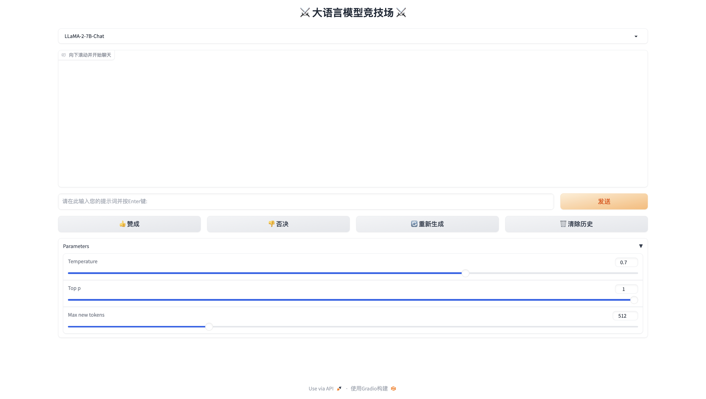

# LLMChat

## Introduction
Inspired by the FastChat project, I also want to build a LLM arena that can be used by Chinese. Due to time constraints, I only provide a single model interactive system based on Gradio. You can change 
`config.py` to configure your own LLM path for inference. Currently, the chat interface has been adapted to LLaMA-2, Baichuan-2 and Qwen, which we use streaming conversations with historical conversation information, it means that you can have an ongoing conversation about a topic. In the future, I will add the vLLM framework to facilitate acceleration and GPU memory optimization during inference.

## Quickstart
First you need to do the following：
```bash
pip install -r requirements.txt
```
and then you need carry out:
```bash
python gradio_single_model.py
```
You will get the following interface:
<p>
    
<p>
